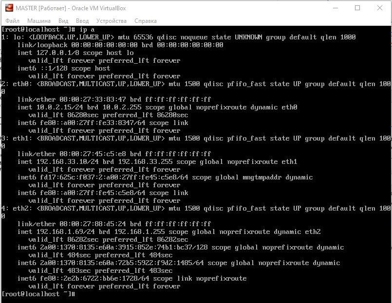
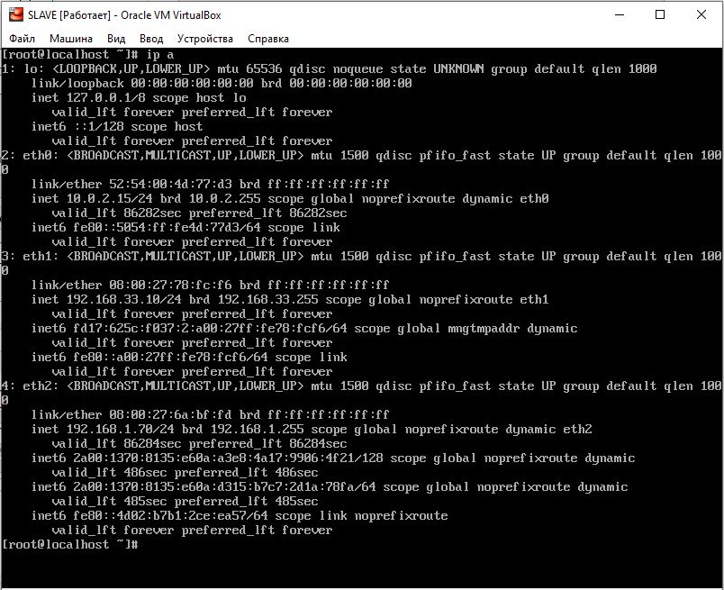

## Масштабирование БД

ip на машине master будет 192.168.1.69



ip на машине slave будет 192.168.1.70



### Настроим серверы

Настраиваем master

```
# This group is read both both by the client and the server
# use it for options that affect everything
#
[client-server]

#
# include *.cnf from the config directory
#
!includedir /etc/my.cnf.d

[mysqld]
#bind-address=0.0.0.0

server-id=1
log_bin=mysql-bin.log
binlog_do_db=skytech

```

Перезапускаем сервис

```
[root@localhost ~]# systemctl stop mariadb
[root@localhost ~]# systemctl status mariadb
● mariadb.service - MariaDB 10.4.13 database server
   Loaded: loaded (/usr/lib/systemd/system/mariadb.service; disabled; vendor preset: disabled)
  Drop-In: /etc/systemd/system/mariadb.service.d
           └─migrated-from-my.cnf-settings.conf
   Active: inactive (dead)
     Docs: man:mysqld(8)
           https://mariadb.com/kb/en/library/systemd/

May 29 10:10:49 localhost.localdomain mysqld[1265]: 2020-05-29 10:10:49 0 [No...
May 29 10:10:49 localhost.localdomain mysqld[1265]: 2020-05-29 10:10:49 0 [No...
May 29 10:10:50 localhost.localdomain mysqld[1265]: 2020-05-29 10:10:50 0 [No...
May 29 10:10:50 localhost.localdomain mysqld[1265]: 2020-05-29 10:10:50 0 [No...
May 29 10:10:50 localhost.localdomain mysqld[1265]: 2020-05-29 10:10:50 0 [No...
May 29 10:10:50 localhost.localdomain mysqld[1265]: 2020-05-29 10:10:50 0 [No...
May 29 10:10:51 localhost.localdomain mysqld[1265]: 2020-05-29 10:10:51 0 [No...
May 29 10:10:51 localhost.localdomain mysqld[1265]: 2020-05-29 10:10:51 0 [No...
May 29 10:10:51 localhost.localdomain mysqld[1265]: 2020-05-29 10:10:51 0 [No...
May 29 10:10:51 localhost.localdomain systemd[1]: Stopped MariaDB 10.4.13 dat...
Hint: Some lines were ellipsized, use -l to show in full.
[root@localhost ~]# systemctl start mariadb

```

Создаем пользователя, который будет отвечать за репликацию (на машине master)

```
MariaDB [(none)]> GRANT REPLICATION SLAVE ON *.* TO 'slave_user'@'%' IDENTIFIED BY 'vagrant';      
Query OK, 0 rows affected (0.001 sec)

```

Производим синхронизацию с блокировкой

```
MariaDB [(none)]> USE skytech;
Reading table information for completion of table and column names
You can turn off this feature to get a quicker startup with -A

Database changed
MariaDB [skytech]> FLUSH TABLES WITH READ LOCK;
Query OK, 0 rows affected (0.004 sec)

```

Фиксируем состояние мастера

```
MariaDB [skytech]> SHOW MASTER STATUS;
+------------------+----------+--------------+------------------+
| File             | Position | Binlog_Do_DB | Binlog_Ignore_DB |
+------------------+----------+--------------+------------------+
| mysql-bin.000001 |      523 | skytech      |                  |
+------------------+----------+--------------+------------------+
1 row in set (0.000 sec)

MariaDB [skytech]> exit;
Bye

```

Делаем дамп базы данных

```
[root@localhost ~]# mysqldump -u root -p --databases skytech > skytech_bck.sql
Enter password:
[root@localhost ~]# ls -lah
total 124M
dr-xr-x---.  6 root root  284 May 29 10:25 .
dr-xr-xr-x. 18 root root  275 May 26 20:04 ..
-rw-------.  1 root root 5.5K Apr 30 22:09 anaconda-ks.cfg
-rw-------   1 root root    0 May 28 20:11 .bash_history
-rw-r--r--.  1 root root   18 Dec 29  2013 .bash_logout
-rw-r--r--.  1 root root  176 Dec 29  2013 .bash_profile
-rw-r--r--.  1 root root  176 Dec 29  2013 .bashrc
drwxr-xr-x   3 root root   22 May 26 20:09 .cache
drwxr-xr-x   3 root root   22 May 26 20:07 .config
-rw-r--r--.  1 root root  100 Dec 29  2013 .cshrc
drwxr-xr-x   3 root root   19 May 26 20:09 .local
-rwxr-xr-x   1 root root  19K May 12 21:36 mariadb_repo_setup
-rw-------   1 root root  217 May 29 10:24 .mysql_history
-rw-------.  1 root root 5.2K Apr 30 22:09 original-ks.cfg
drwxr-----.  3 root root   19 May 26 09:13 .pki
-rw-r--r--   1 root root 124M May 29 10:25 skytech_bck.sql
-rw-r--r--.  1 root root  129 Dec 29  2013 .tcshrc

```

И разблокируем таблицы этой БД

```
[root@localhost ~]# mysql -u root -p
Enter password:
Welcome to the MariaDB monitor.  Commands end with ; or \g.
Your MariaDB connection id is 12
Server version: 10.4.13-MariaDB-log MariaDB Server

Copyright (c) 2000, 2018, Oracle, MariaDB Corporation Ab and others.

Type 'help;' or '\h' for help. Type '\c' to clear the current input statement.

MariaDB [(none)]> UNLOCK TABLES;
Query OK, 0 rows affected (0.000 sec)

```

Создаем БД на slave с таким же именем как на master

```
MariaDB [(none)]> CREATE DATABASE skytech;
Query OK, 1 row affected (0.000 sec)

MariaDB [(none)]> exit;
Bye

```

Заливаем дамп из master на реплику

```
MariaDB [(none)]> USE skytech;
Database changed
MariaDB [skytech]> source /vagrant/skytech_bck.sql
Query OK, 0 rows affected (0.000 sec)

Query OK, 0 rows affected (0.000 sec)
...
...

```

Теперь настраиваем реплику

```
# This group is read both both by the client and the server
# use it for options that affect everything
#
[client-server]

#
# include *.cnf from the config directory
#
!includedir /etc/my.cnf.d

[mysqld]
#bind-address=0.0.0.0


server-id=2
relay-log=mysql-relay-bin.log
log_bin=mysql-bin.log
replicate_do_db=skytech

```

Включаем репликацию

```
MariaDB [(none)]> CHANGE MASTER TO MASTER_HOST='192.168.1.70', MASTER_USER='slav                          e_user', MASTER_PASSWORD='password', MASTER_LOG_FILE='mysql-bin.000001', MASTER_                          LOG_POS=523;
Query OK, 0 rows affected (0.006 sec)

MariaDB [(none)]> START SLAVE;
Query OK, 0 rows affected (0.002 sec)

MariaDB [(none)]> SHOW SLAVE STATUS;
+----------------------+--------------+-------------+-------------+-------------                          --+------------------+---------------------+----------------------------+-------                          --------+-----------------------+------------------+-------------------+--------                          ---------+---------------------+--------------------+------------------------+--                          -----------------------+-----------------------------+------------+------------+                          --------------+---------------------+-----------------+-----------------+-------                          ---------+---------------+--------------------+--------------------+------------                          --------+-----------------+-------------------+----------------+----------------                          -------+-------------------------------+---------------+------------------------                          --------------------------------------------------------------------------------                          --------------------------------------------------------------------------------                          -----------------------------------------------------------+----------------+---                          -------------+-----------------------------+------------------+----------------+                          --------------------+------------+-------------+-------------------------+------                          -----------------------+---------------+-----------+---------------------+------                          -----------------------------------------------------------------------+--------                          ----------+--------------------------------+----------------------------+
| Slave_IO_State       | Master_Host  | Master_User | Master_Port | Connect_Retr                          y | Master_Log_File  | Read_Master_Log_Pos | Relay_Log_File             | Relay_                          Log_Pos | Relay_Master_Log_File | Slave_IO_Running | Slave_SQL_Running | Replica                          te_Do_DB | Replicate_Ignore_DB | Replicate_Do_Table | Replicate_Ignore_Table | R                          eplicate_Wild_Do_Table | Replicate_Wild_Ignore_Table | Last_Errno | Last_Error |                           Skip_Counter | Exec_Master_Log_Pos | Relay_Log_Space | Until_Condition | Until_                          Log_File | Until_Log_Pos | Master_SSL_Allowed | Master_SSL_CA_File | Master_SSL_                          CA_Path | Master_SSL_Cert | Master_SSL_Cipher | Master_SSL_Key | Seconds_Behind_                          Master | Master_SSL_Verify_Server_Cert | Last_IO_Errno | Last_IO_Error                                                                                                                                                                                                                                                                                                                   | Last_SQL_Errno | La                          st_SQL_Error | Replicate_Ignore_Server_Ids | Master_Server_Id | Master_SSL_Crl |                           Master_SSL_Crlpath | Using_Gtid | Gtid_IO_Pos | Replicate_Do_Domain_Ids | Repli                          cate_Ignore_Domain_Ids | Parallel_Mode | SQL_Delay | SQL_Remaining_Delay | Slave                          _SQL_Running_State                                                     | Slave_D                          DL_Groups | Slave_Non_Transactional_Groups | Slave_Transactional_Groups |
+----------------------+--------------+-------------+-------------+-------------                          --+------------------+---------------------+----------------------------+-------                          --------+-----------------------+------------------+-------------------+--------                          ---------+---------------------+--------------------+------------------------+--                          -----------------------+-----------------------------+------------+------------+                          --------------+---------------------+-----------------+-----------------+-------                          ---------+---------------+--------------------+--------------------+------------                          --------+-----------------+-------------------+----------------+----------------                          -------+-------------------------------+---------------+------------------------                          --------------------------------------------------------------------------------                          --------------------------------------------------------------------------------                          -----------------------------------------------------------+----------------+---                          -------------+-----------------------------+------------------+----------------+                          --------------------+------------+-------------+-------------------------+------                          -----------------------+---------------+-----------+---------------------+------                          -----------------------------------------------------------------------+--------                          ----------+--------------------------------+----------------------------+
| Connecting to master | 192.168.1.70 | slave_user  |        3306 |            6                          0 | mysql-bin.000001 |                 523 | localhost-relay-bin.000001 |                                       4 | mysql-bin.000001      | Connecting       | Yes               |                                           |                     |                    |                        |                                                   |                             |          0 |            |                                      0 |                 523 |             256 | None            |                                          |             0 | No                 |                    |                                              |                 |                   |                |                                            NULL | No                            |          2013 | error connecting to mas                          ter 'slave_user@192.168.1.70:3306' - retry-time: 60  maximum-retries: 86400  mes                          sage: Lost connection to MySQL server at 'reading initial communication packet',                           system error: 0 "Internal error/check (Not system error)" |              0 |                                          |                             |                0 |                |                                              | No         |             |                         |                                                       | conservative  |         0 |                NULL | Slave                           has read all relay log; waiting for the slave I/O thread to update it |                                          0 |                              0 |                          0 |
+----------------------+--------------+-------------+-------------+-------------                          --+------------------+---------------------+----------------------------+-------                          --------+-----------------------+------------------+-------------------+--------                          ---------+---------------------+--------------------+------------------------+--                          -----------------------+-----------------------------+------------+------------+                          --------------+---------------------+-----------------+-----------------+-------                          ---------+---------------+--------------------+--------------------+------------                          --------+-----------------+-------------------+----------------+----------------                          -------+-------------------------------+---------------+------------------------                          --------------------------------------------------------------------------------                          --------------------------------------------------------------------------------                          -----------------------------------------------------------+----------------+---                          -------------+-----------------------------+------------------+----------------+                          --------------------+------------+-------------+-------------------------+------                          -----------------------+---------------+-----------+---------------------+------                          -----------------------------------------------------------------------+--------                          ----------+--------------------------------+----------------------------+
1 row in set (0.000 sec)
