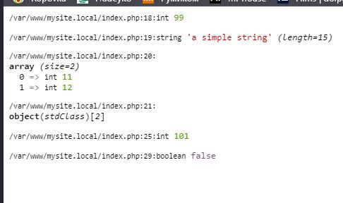

## Разворачиваем механизмы кеширования на виртуальной машине

### Memcached

Устанавливаем и проверяем Memcached

```
[root@localhost ~]# yum install memcached php72-php-pecl-memcached
Loaded plugins: fastestmirror
Loading mirror speeds from cached hostfile
epel/x86_64/metalink                                     |  26 kB     00:00
 * base: mirror.corbina.net
 * epel: mirror.datacenter.by
 * extras: mirror.corbina.net
 * remi-safe: mirror.reconn.ru
 * updates: mirror.logol.ru
epel                                                     | 4.7 kB     00:00
(1/2): epel/x86_64/updateinfo                              | 1.0 MB   00:15
(2/2): epel/x86_64/primary_db                              | 6.8 MB   00:00
Package memcached-1.4.15-10.el7_3.1.x86_64 already installed and latest version
Resolving Dependencies
--> Running transaction check
---> Package php72-php-pecl-memcached.x86_64 0:3.1.5-1.el7.remi will be installed
--> Processing Dependency: fastlz(x86-64) for package: php72-php-pecl-memcached-3.1.5-1.el7.remi.x86_64
--> Processing Dependency: libmemcached-opt-libs(x86-64) for package: php72-php-pecl-memcached-3.1.5-1.el7.remi.x86_64
--> Processing Dependency: php72-php-pecl-igbinary(x86-64) for package: php72-php-pecl-memcached-3.1.5-1.el7.remi.x86_64
--> Processing Dependency: php72-php-pecl-msgpack(x86-64) for package: php72-php-pecl-memcached-3.1.5-1.el7.remi.x86_64
--> Running transaction check
---> Package fastlz.x86_64 0:0.1.0-0.1.20070619svnrev12.el7 will be installed
---> Package libmemcached-opt-libs.x86_64 0:1.0.18-2.el7.remi will be installed
---> Package php72-php-pecl-igbinary.x86_64 0:3.1.2-1.el7.remi will be installed
---> Package php72-php-pecl-msgpack.x86_64 0:2.1.0-1.el7.remi will be installed
--> Finished Dependency Resolution

Dependencies Resolved

================================================================================
 Package                  Arch   Version                        Repository
                                                                           Size
================================================================================
Installing:
 php72-php-pecl-memcached x86_64 3.1.5-1.el7.remi               remi-safe  69 k
Installing for dependencies:
 fastlz                   x86_64 0.1.0-0.1.20070619svnrev12.el7 epel      9.8 k
 libmemcached-opt-libs    x86_64 1.0.18-2.el7.remi              remi-safe 127 k
 php72-php-pecl-igbinary  x86_64 3.1.2-1.el7.remi               remi-safe  66 k
 php72-php-pecl-msgpack   x86_64 2.1.0-1.el7.remi               remi-safe  43 k

Transaction Summary
================================================================================
Install  1 Package (+4 Dependent packages)

Total download size: 314 k
Installed size: 812 k
Is this ok [y/d/N]: y
Downloading packages:
(1/5): fastlz-0.1.0-0.1.20070619svnrev12.el7.x86_64.rpm    | 9.8 kB   00:15
(2/5): php72-php-pecl-igbinary-3.1.2-1.el7.remi.x86_64.rpm |  66 kB   00:30
(3/5): php72-php-pecl-memcached-3.1.5-1.el7.remi.x86_64.rp |  69 kB   00:00
(4/5): php72-php-pecl-msgpack-2.1.0-1.el7.remi.x86_64.rpm  |  43 kB   00:00
(5/5): libmemcached-opt-libs-1.0.18-2.el7.remi.x86_64.rpm  | 127 kB   00:31
--------------------------------------------------------------------------------
Total                                               10 kB/s | 314 kB  00:31
Running transaction check
Running transaction test
Transaction test succeeded
Running transaction
  Installing : php72-php-pecl-msgpack-2.1.0-1.el7.remi.x86_64               1/5
  Installing : libmemcached-opt-libs-1.0.18-2.el7.remi.x86_64               2/5
  Installing : fastlz-0.1.0-0.1.20070619svnrev12.el7.x86_64                 3/5
  Installing : php72-php-pecl-igbinary-3.1.2-1.el7.remi.x86_64              4/5
  Installing : php72-php-pecl-memcached-3.1.5-1.el7.remi.x86_64             5/5
  Verifying  : php72-php-pecl-igbinary-3.1.2-1.el7.remi.x86_64              1/5
  Verifying  : php72-php-pecl-memcached-3.1.5-1.el7.remi.x86_64             2/5
  Verifying  : fastlz-0.1.0-0.1.20070619svnrev12.el7.x86_64                 3/5
  Verifying  : libmemcached-opt-libs-1.0.18-2.el7.remi.x86_64               4/5
  Verifying  : php72-php-pecl-msgpack-2.1.0-1.el7.remi.x86_64               5/5

Installed:
  php72-php-pecl-memcached.x86_64 0:3.1.5-1.el7.remi

Dependency Installed:
  fastlz.x86_64 0:0.1.0-0.1.20070619svnrev12.el7
  libmemcached-opt-libs.x86_64 0:1.0.18-2.el7.remi
  php72-php-pecl-igbinary.x86_64 0:3.1.2-1.el7.remi
  php72-php-pecl-msgpack.x86_64 0:2.1.0-1.el7.remi

Complete!

[root@localhost ~]# systemctl start php72-php-fpm

[root@localhost ~]# cat /etc/sysconfig/memcached
PORT="11211"
USER="memcached"
MAXCONN="1024"
CACHESIZE="64"
OPTIONS=""

[root@localhost ~]# systemctl start memcached
[root@localhost ~]# systemctl status memcached
● memcached.service - Memcached
   Loaded: loaded (/usr/lib/systemd/system/memcached.service; disabled; vendor preset: disabled)
   Active: active (running) since Tue 2020-06-02 08:32:49 UTC; 1min 47s ago
 Main PID: 1735 (memcached)
   CGroup: /system.slice/memcached.service
           └─1735 /usr/bin/memcached -u memcached -p 11211 -m 64 -c 1024

Jun 02 08:32:49 localhost.localdomain systemd[1]: Started Memcached.

[root@localhost ~]# netstat -tap | grep memcached
tcp        0      0 0.0.0.0:memcache        0.0.0.0:*               LISTEN      1735/memcached
tcp6       0      0 [::]:memcache           [::]:*                  LISTEN      1735/memcached

[root@localhost ~]# find / -name php-fpm
/etc/opt/remi/php72/sysconfig/php-fpm
/var/opt/remi/php72/log/php-fpm
/var/opt/remi/php72/run/php-fpm
/opt/remi/php72/root/usr/sbin/php-fpm

[root@localhost ~]# /opt/remi/php72/root/usr/sbin/php-fpm -m | grep memcached
memcached

```

Чтобы работать с механизмом кеширования, нужно выполнить следующие операции:
1.	Создать объект класса Memcahed.
2.	Подключиться к серверу кеша.
3.	Задать или забрать значение.

```
<?php
// создаем инстанс
$m = new Memcached();

// подключаемся к серверу
$m->addServer('localhost', 11211);

// добавляем переменные в кеш
// первое значение — имя ключа, второе - значение
$m->set('int', 99);
$m->set('string', 'a simple string');
$m->set('array', array(11, 12));

// здесь указываем время хранения записи с ключом 'object' - 5 минут
$m->set('object', new stdclass, time() + 300);

// теперь можем вытаскивать значения прямо из кеша
var_dump($m->get('int'));
var_dump($m->get('string'));
var_dump($m->get('array'));
var_dump($m->get('object'));

// заменяем значение
$m->replace('int', 101);
var_dump($m->get('int'));

// удаляем значение
$m->delete('int');
var_dump($m->get('int'));

?>
```

запустим и посмотрим результат



кеширование работает.

### Redis

Устанавливаем и проверяем Redis

```
[root@localhost ~]# yum install redis-server php72-php-pecl-redis
Loaded plugins: fastestmirror
Loading mirror speeds from cached hostfile
 * base: mirror.corbina.net
 * epel: mirror.nsc.liu.se
 * extras: mirror.corbina.net
 * remi-safe: mirror.reconn.ru
 * updates: mirror.logol.ru
No package redis-server available.
Resolving Dependencies
--> Running transaction check
---> Package php72-php-pecl-redis.x86_64 0:3.1.6-1.el7.remi will be installed
--> Finished Dependency Resolution

Dependencies Resolved

================================================================================
 Package                  Arch       Version                Repository     Size
================================================================================
Installing:
 php72-php-pecl-redis     x86_64     3.1.6-1.el7.remi       remi-safe     156 k

Transaction Summary
================================================================================
Install  1 Package

Total download size: 156 k
Installed size: 555 k
Is this ok [y/d/N]: y
Downloading packages:
php72-php-pecl-redis-3.1.6-1.el7.remi.x86_64.rpm           | 156 kB   00:30
Running transaction check
Running transaction test
Transaction test succeeded
Running transaction
  Installing : php72-php-pecl-redis-3.1.6-1.el7.remi.x86_64                 1/1
  Verifying  : php72-php-pecl-redis-3.1.6-1.el7.remi.x86_64                 1/1

Installed:
  php72-php-pecl-redis.x86_64 0:3.1.6-1.el7.remi

Complete!

[root@localhost ~]# systemctl status redis-server
Unit redis-server.service could not be found.

[root@localhost ~]# yum install redis
Loaded plugins: fastestmirror
Loading mirror speeds from cached hostfile
 * base: mirror.corbina.net
 * epel: mirror.datacenter.by
 * extras: mirror.corbina.net
 * remi-safe: mirror.reconn.ru
 * updates: mirror.logol.ru
Resolving Dependencies
--> Running transaction check
---> Package redis.x86_64 0:3.2.12-2.el7 will be installed
--> Processing Dependency: libjemalloc.so.1()(64bit) for package: redis-3.2.12-2.el7.x86_64
--> Running transaction check
---> Package jemalloc.x86_64 0:3.6.0-1.el7 will be installed
--> Finished Dependency Resolution

Dependencies Resolved

================================================================================
 Package           Arch            Version                  Repository     Size
================================================================================
Installing:
 redis             x86_64          3.2.12-2.el7             epel          544 k
Installing for dependencies:
 jemalloc          x86_64          3.6.0-1.el7              epel          105 k

Transaction Summary
================================================================================
Install  1 Package (+1 Dependent package)

Total download size: 648 k
Installed size: 1.7 M
Is this ok [y/d/N]: y
Downloading packages:
(1/2): jemalloc-3.6.0-1.el7.x86_64.rpm                     | 105 kB   00:15
(2/2): redis-3.2.12-2.el7.x86_64.rpm                       | 544 kB   00:00
--------------------------------------------------------------------------------
Total                                               42 kB/s | 648 kB  00:15
Running transaction check
Running transaction test
Transaction test succeeded
Running transaction
  Installing : jemalloc-3.6.0-1.el7.x86_64                                  1/2
  Installing : redis-3.2.12-2.el7.x86_64                                    2/2
  Verifying  : redis-3.2.12-2.el7.x86_64                                    1/2
  Verifying  : jemalloc-3.6.0-1.el7.x86_64                                  2/2

Installed:
  redis.x86_64 0:3.2.12-2.el7

Dependency Installed:
  jemalloc.x86_64 0:3.6.0-1.el7

Complete!

[root@localhost ~]# systemctl status redis
● redis.service - Redis persistent key-value database
   Loaded: loaded (/usr/lib/systemd/system/redis.service; disabled; vendor preset: disabled)
  Drop-In: /etc/systemd/system/redis.service.d
           └─limit.conf
   Active: inactive (dead)

[root@localhost ~]# systemctl start redis

[root@localhost ~]# systemctl status redis
● redis.service - Redis persistent key-value database
   Loaded: loaded (/usr/lib/systemd/system/redis.service; disabled; vendor preset: disabled)
  Drop-In: /etc/systemd/system/redis.service.d
           └─limit.conf
   Active: active (running) since Tue 2020-06-02 10:23:04 UTC; 1s ago
 Main PID: 5755 (redis-server)
   CGroup: /system.slice/redis.service
           └─5755 /usr/bin/redis-server 127.0.0.1:6379

Jun 02 10:23:04 localhost.localdomain systemd[1]: Starting Redis persistent k...
Jun 02 10:23:04 localhost.localdomain systemd[1]: Started Redis persistent ke...
Hint: Some lines were ellipsized, use -l to show in full.

[root@localhost ~]# systemctl restart php72-php-fpm
```

Попробуем создание, выборку, модификацию, удаление и базовую информацию об объектах

```
[root@localhost ~]# redis-cli

127.0.0.1:6379> set test:1:string "my binary safe string"
OK
127.0.0.1:6379> get test:1:string
"my binary safe string"
127.0.0.1:6379> getset test:1:string "other value"
"my binary safe string"
127.0.0.1:6379> type test:1:string
string
127.0.0.1:6379> set test:1:vlaue "487"
OK
127.0.0.1:6379> rename test:1:vlaue test:1:value
OK
127.0.0.1:6379> exists  test:1:vlaue
(integer) 0
127.0.0.1:6379> exists test:1:value
(integer) 1
127.0.0.1:6379> keys test:1:*
1) "test:1:value"
2) "test:1:string"
127.0.0.1:6379> del test:1:value
(integer) 1
127.0.0.1:6379> keys test:1:*
1) "test:1:string"
127.0.0.1:6379>

```

Redis работает.